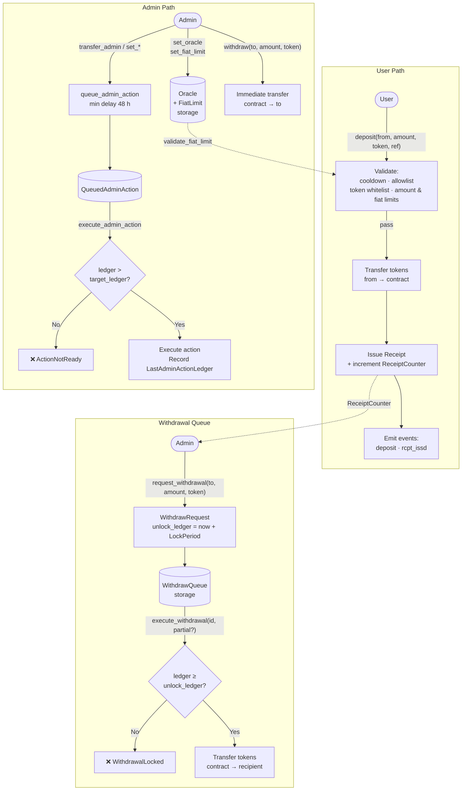

# Stellar Contracts

This directory contains the Soroban smart contracts for the Stellar DEX Chat application.

## Contracts

| Contract | Description |
|----------|-------------|
| [FiatBridge](./FIAT_BRIDGE_README.md) | Deposit receipt system, withdrawal queue, oracle-based fiat caps, and timelock admin |

---

## Architecture Diagram

The diagram below shows the complete **FiatBridge** flow: from a user deposit through receipt issuance, withdrawal queue, and admin operations.



> **Admin path detail:** `set_operator` and privileged mutations go through `queue_admin_action` with a ≥ 48-hour (`MIN_TIMELOCK_DELAY = 34_560 ledgers`) delay before `execute_admin_action` can be called. Fee accrual (`accrue_fee`) and fee withdrawal (`withdraw_fees`) map to `set_fiat_limit` / `withdraw` respectively.

---

## Development

```bash
# Build
cargo build --target wasm32-unknown-unknown --release

# Test
cargo test

# Deploy (Testnet)
stellar contract deploy \
  --wasm target/wasm32-unknown-unknown/release/stellar_contracts.wasm \
  --network testnet
```

See [FIAT_BRIDGE_README.md](./FIAT_BRIDGE_README.md) for full API reference and error code documentation.
